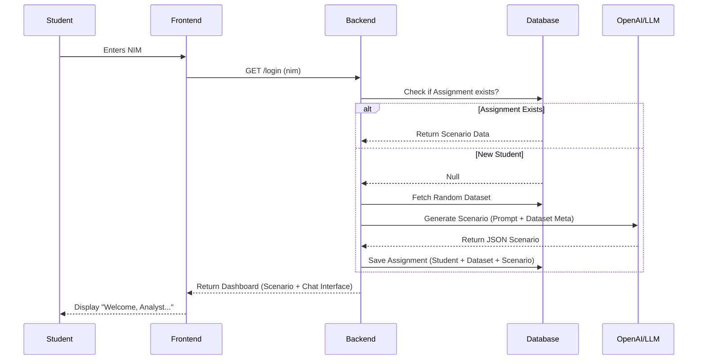
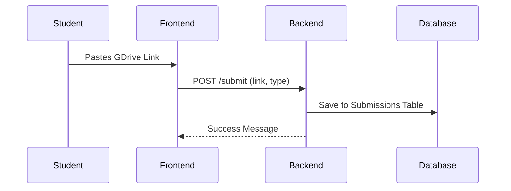
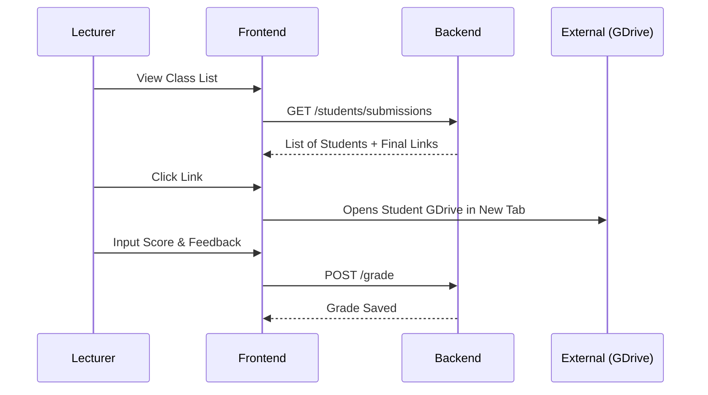

# Product Requirement Document (MVP): Biomedical Analyst Roleplay Platform

**Version:** 1.0 (MVP Fast-Track)
**Date:** 2024-05-20
**Status:** Approved for Development

---

## 1. Executive Summary
This platform is an educational simulation tool where students roleplay as data analysts in a biomedical setting. The system automates the creation of unique, immersive scenarios for each student based on real datasets, facilitated by an LLM "Stakeholder" persona.

**Key Constraints for MVP:**
* **Zero-Barrier Login:** Students access via NIM only (no passwords).
* **Just-in-Time Generation:** Scenarios are created strictly when the student logs in, not in batches.
* **External Submissions:** All deliverables are submitted via Google Drive links.

---

## 2. Objectives
1.  **Immersive Context:** Transform dry datasets into "business problems" via LLM personas.
2.  **Scalable Distribution:** Randomly assign datasets and generate unique contexts without manual professor effort.
3.  **Simplified Tracking:** Centralize all assignment links (Progress & Final) in one dashboard for grading.

---

## 3. User Roles & Authentication

### 3.1 Students
* **Login:** Input `NIM` (Student ID) only.
    * *Logic:* System checks if NIM exists in the roster. If yes, log in. No password/OTP required.
* **Capabilities:** View Scenario, Chat with Stakeholder, Submit GDrive Links.

### 3.2 Lecturers (Admins)
* **Login:** Email + Password (standard security required here to protect configuration).
* **Capabilities:** Upload Rosters, Add Datasets, View Submissions, Input Grades.

---

## 4. Functional Requirements

### 4.1 Dataset Management
* **Input:** Lecturer provides a Name, Description, and a **Direct Hyperlink** (e.g., to a public CSV or GDrive folder).
* **Constraint:** The system does **not** store data files. It only stores the URL.
* **Error Handling:** None. If a link breaks, students notify the lecturer offline.

### 4.2 "Just-in-Time" Scenario Assignment
* **Trigger:** The moment a student logs in successfully.
* **Logic:**
    1.  Check: Does this student already have an assignment?
    2.  **If YES:** Load existing data.
    3.  **If NO:**
        * Select a Dataset from the available pool (Random or Round-robin).
        * **Call LLM API:** Send Student Profile + Dataset Metadata.
        * Generate Scenario JSON (Role, Problem Statement, Stakeholder Persona).
        * Save to Database.
        * Load the new dashboard.

### 4.3 The "Stakeholder" Chat
* **Function:** A text chat interface embedded in the dashboard.
* **Persona:** The LLM acts as a hospital staff member (e.g., Dr. House, Head Nurse) based on the generated scenario.
* **Privacy:** Chat is private to the student session.
* **Context:** The LLM must remember previous messages within the session.
* **Constraint:** The Professor **cannot** view these logs in the MVP.

### 4.4 Submissions
* **Format:** Text input field for URL (Google Drive/Colab link).
* **Types:**
    * *Progress Report:* Optional, multiple submissions allowed.
    * *Final Report:* Mandatory, marks the project as "Ready for Grading."

### 4.5 Grading (Manual)
* Lecturer clicks the "Student Submission Link" (opens in new tab).
* Lecturer returns to platform to input:
    * Numeric Score (0-100).
    * Text Feedback.

---

## 5. System Architecture & Database (ERD)

### 5.1 Tech Stack Recommendation
* **Frontend:** React (Simple SPA).
* **Backend:** FastAPI (Python) or Node.js.
* **Database:** PostgreSQL (Preferred) or SQLite (for simplest local deploy).
* **LLM:** OpenAI API (GPT-3.5-Turbo or GPT-4o-mini for cost/speed balance).

### 5.2 Entity Relationship Diagram (Text Schema)

**Note:** `chat_logs` exists solely for LLM memory context, not for lecturer review.

```text
[users] (Lecturers)
+ id (PK)
+ email
+ password_hash

[students]
+ nim (PK)  <-- Acts as username
+ name

[datasets]
+ id (PK)
+ name
+ url (Hyperlink)
+ metadata_summary (Text for LLM context)

[assignments]
+ id (PK)
+ student_nim (FK -> students.nim)
+ dataset_id (FK -> datasets.id)
+ scenario_json (Stores the LLM output: Role, Problem, Persona)
+ created_at

[chat_messages]
+ id (PK)
+ assignment_id (FK -> assignments.id)
+ sender (Enum: 'student', 'ai')
+ content (Text)
+ timestamp

[submissions]
+ id (PK)
+ assignment_id (FK -> assignments.id)
+ link_url (Text)
+ submission_type (Enum: 'progress', 'final')
+ created_at

[grades]
+ assignment_id (FK -> assignments.id)
+ score (Int)
+ feedback (Text)
````

-----

## 6\. System Flow Diagrams

### 6.1 Student: First Login (JIT Generation)



### 6.2 Student: Submission



### 6.3 Lecturer: Grading



-----

## 7\. Known Limitations (MVP)

1.  **Security:** No password protection for students. Relies on trust.
2.  **No Chat Oversight:** Lecturers cannot verify if the student "cheated" by asking the LLM for direct code answers.
3.  **Data Persistence:** If the LLM generates a bad scenario (hallucination), the student is stuck with it unless an Admin manually deletes the assignment row in the DB to trigger regeneration.

<!-- end list -->

```

***

### Senior PM Closing Note
This document is now **ready to build**. It is lean and removes almost all the complex bottlenecks.

The riskiest part remaining is the **LLM Prompt**. Since we removed the ability for you to see the chat logs, we need to make sure the "System Prompt" given to the AI is very strict about **not writing code**.

**Next Step:** I can write the **System Prompt** for you (the instructions that tell the AI how to behave: *"You are a hospital stakeholder, do not write SQL code, only describe business problems..."*).
